# Architecture Documentation

This document describes the architecture of the SkyHigh Core Digital Check-In System.

---

## 1. Architecture Overview

SkyHigh Core follows a **modular monolith** architecture, providing the simplicity of a single deployable unit while maintaining clear domain boundaries for future scalability.

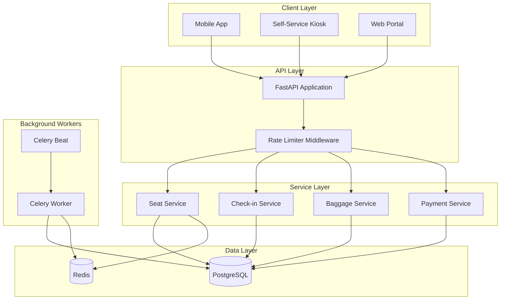

---

## 2. System Components

### 2.1 API Layer (FastAPI)

The API layer handles all HTTP requests and provides:

- **Request Validation**: Pydantic schemas validate all input
- **Rate Limiting**: Redis-based middleware prevents abuse
- **Authentication**: Token-based auth (simplified for demo)
- **OpenAPI Documentation**: Auto-generated API docs

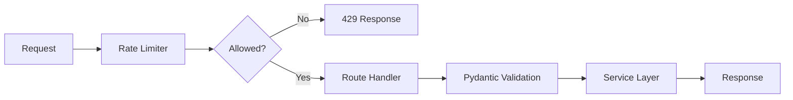

### 2.2 Service Layer

Business logic is encapsulated in domain services:

| Service | Responsibility |
|---------|----------------|
| **SeatService** | Seat lifecycle management, locking |
| **CheckInService** | Orchestrates check-in workflow |
| **BaggageService** | Weight validation, fee calculation |
| **PaymentService** | Payment processing (simulated) |
| **FlightService** | Flight data management |

### 2.3 Data Layer

#### PostgreSQL (Primary Database)
- **Source of truth** for all data
- Handles transactional consistency
- Row-level locking for concurrent seat access

#### Redis (Cache & Auxiliary)
- **Seat map caching** for fast reads
- **Rate limiting** counters
- **Task queue broker** for Celery

### 2.4 Background Workers

#### Celery Worker
- Processes async tasks
- Handles seat hold expiration
- Runs cleanup jobs

#### Celery Beat
- Schedules periodic tasks
- Triggers cleanup every 30 seconds

---

## 3. Data Flow

### 3.1 Read Flow (Seat Map)

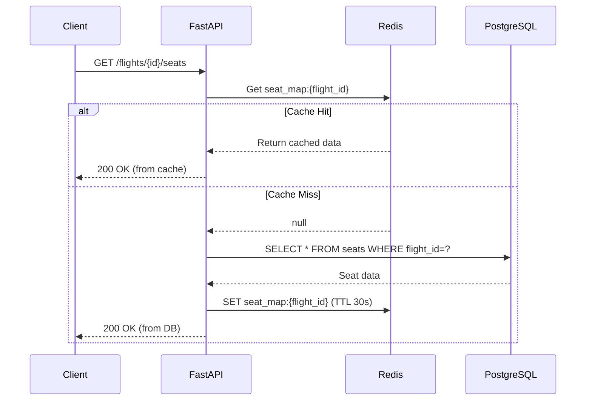

### 3.2 Write Flow (Seat Hold)

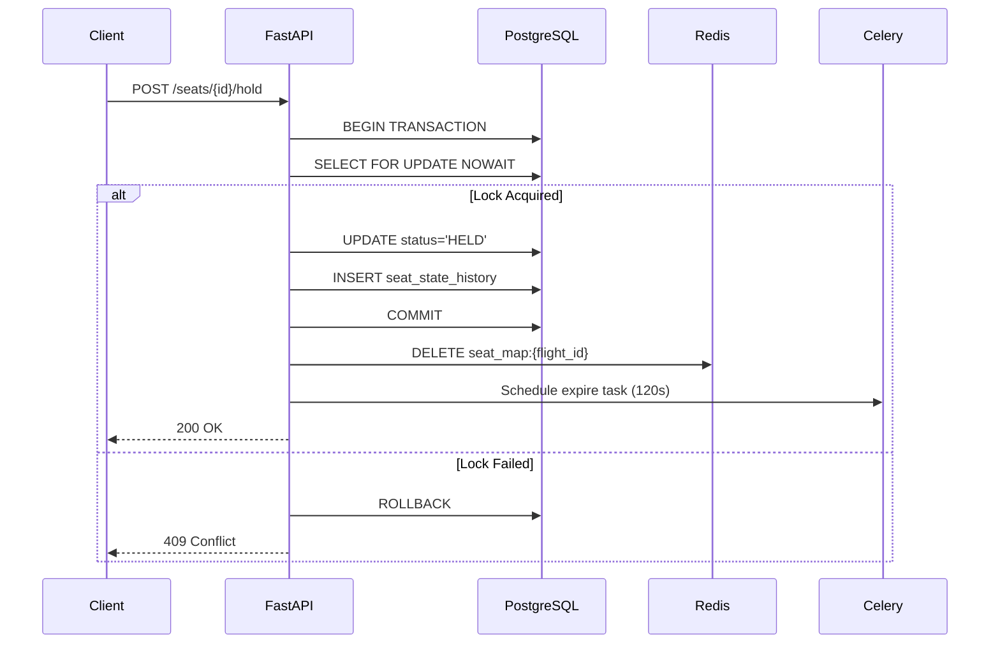

### 3.3 Complete Check-in Flow

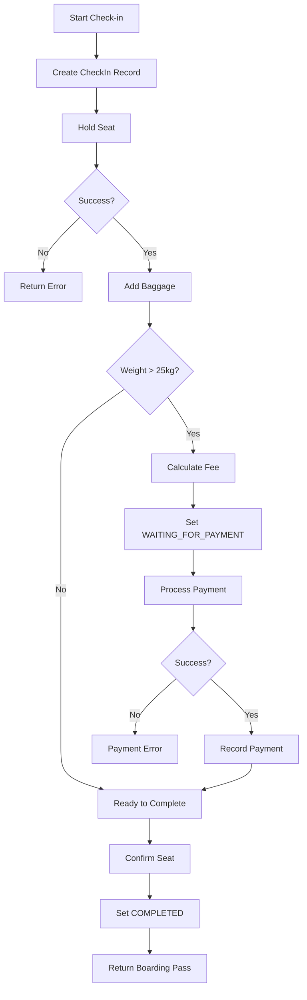

---

## 4. Concurrency Architecture

### 4.1 Locking Strategy

We use **pessimistic locking** with PostgreSQL's `FOR UPDATE NOWAIT`:

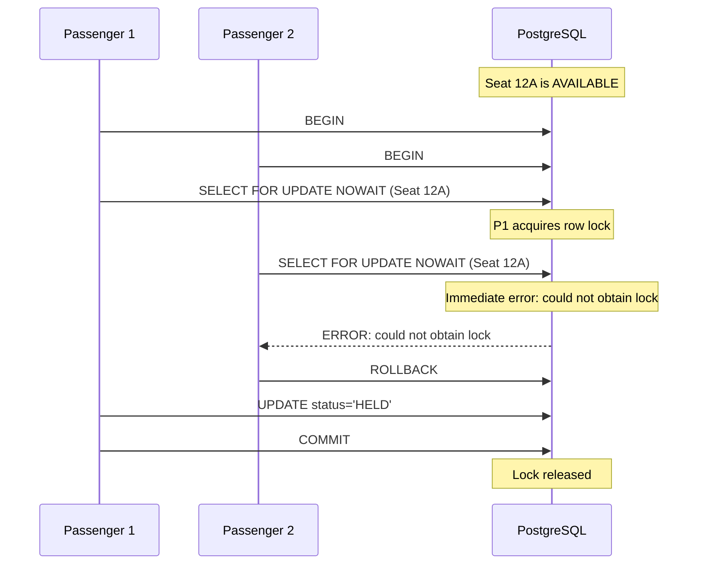

### 4.2 Why NOWAIT?

| Option | Behavior | Use Case |
|--------|----------|----------|
| `FOR UPDATE` | Wait for lock | Batch processing |
| `FOR UPDATE NOWAIT` | Fail immediately | User-facing APIs ✓ |
| `FOR UPDATE SKIP LOCKED` | Skip locked rows | Queue processing |

**NOWAIT** is ideal because:
1. Provides instant feedback to users
2. Prevents request pile-up
3. Client can retry or select different seat

---

## 5. Caching Architecture

### 5.1 Cache-Aside Pattern

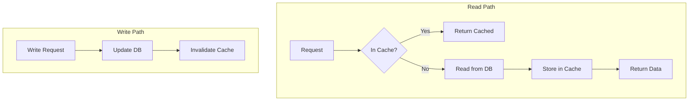

### 5.2 Cache Configuration

| Key | TTL | Invalidation |
|-----|-----|--------------|
| `seat_map:{flight_id}` | 30s | On any seat change |
| `seat:{seat_id}` | 30s | On seat change |
| `flight:{flight_id}` | 5min | Rarely changes |

### 5.3 Cache Consistency

We prioritize **availability over consistency** for seat maps:
- Cache may be up to 30s stale
- Seat holds use direct DB access (no cache)
- Cache invalidation on write ensures eventual consistency

---

## 6. Scalability

### 6.1 Current Architecture Limits

| Component | Limit | Bottleneck |
|-----------|-------|------------|
| API Servers | ~10 instances | Stateless, easily scaled |
| PostgreSQL | ~1000 connections | Connection pooling helps |
| Redis | ~100k ops/sec | Cluster if needed |
| Celery Workers | ~50 workers | Memory bound |

### 6.2 Scaling Strategies

#### Horizontal Scaling (Supported)
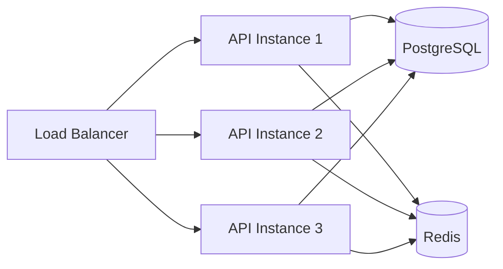

#### Database Scaling Options
1. **Read Replicas**: Route read-heavy seat map queries
2. **Connection Pooling**: PgBouncer for connection management
3. **Partitioning**: Partition seats table by flight date

#### Future Microservices Split
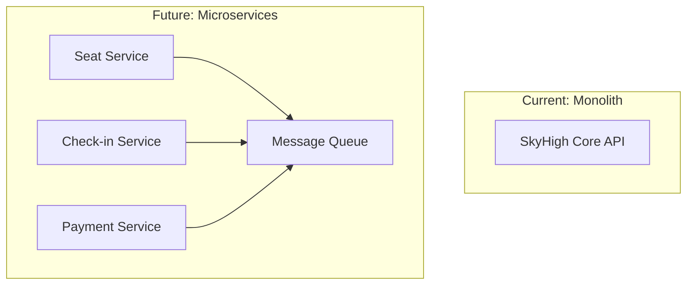

---

## 7. Reliability

### 7.1 Failure Modes

| Failure | Impact | Mitigation |
|---------|--------|------------|
| API crash | Service unavailable | Multiple instances + health checks |
| DB connection lost | All operations fail | Connection retry + circuit breaker |
| Redis down | Cache miss, slow responses | Fallback to DB, degraded mode |
| Worker crash | Holds not expired | Periodic cleanup job (fallback) |

### 7.2 Health Checks

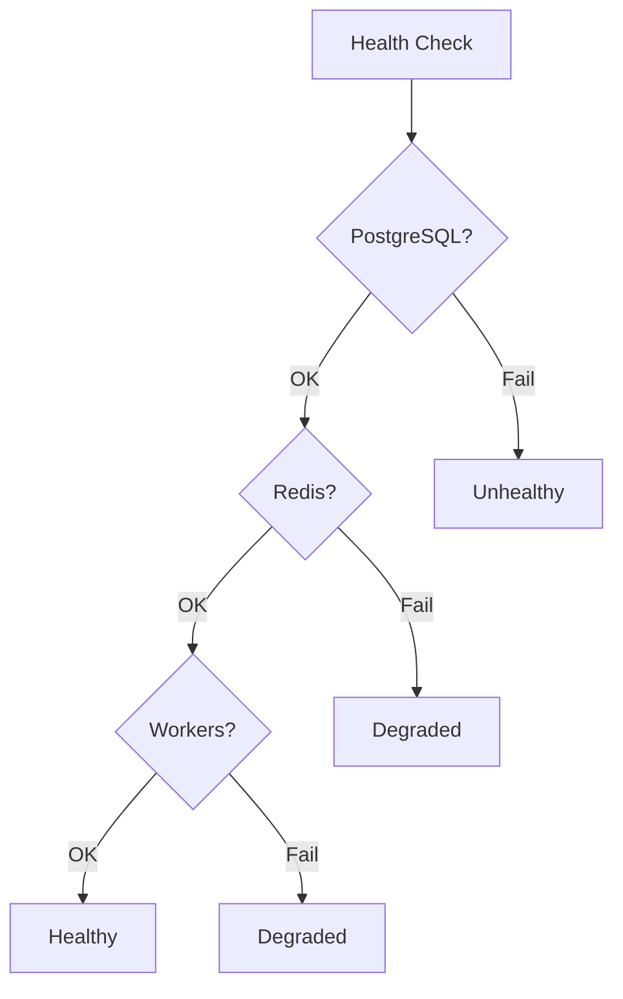

### 7.3 Circuit Breaker Pattern

For external service calls (payment):

```python
@circuit_breaker(failure_threshold=5, recovery_timeout=30)
async def process_payment(payment_request):
    # If 5 failures in a row, circuit opens
    # After 30s, circuit half-opens to test
    return await external_payment_service.charge(payment_request)
```

---

## 8. Security

### 8.1 Rate Limiting

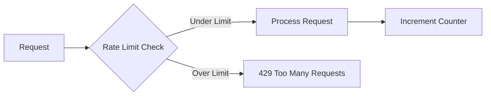

### 8.2 Security Measures

| Layer | Protection |
|-------|------------|
| **Transport** | HTTPS required |
| **Input** | Pydantic validation |
| **Rate Limiting** | Per-IP and per-user |
| **SQL Injection** | SQLAlchemy ORM |
| **Authentication** | Token-based (simplified) |

---

## 9. Monitoring & Observability

### 9.1 Logging

```python
# Structured logging format
{
    "timestamp": "2026-03-09T10:30:00Z",
    "level": "INFO",
    "service": "seat-service",
    "action": "seat_held",
    "seat_id": "uuid",
    "passenger_id": "uuid",
    "flight_id": "uuid",
    "duration_ms": 45
}
```

### 9.2 Metrics (Recommended)

| Metric | Type | Description |
|--------|------|-------------|
| `seat_hold_duration_seconds` | Histogram | Time to hold seat |
| `seat_hold_success_total` | Counter | Successful holds |
| `seat_hold_conflict_total` | Counter | Lock conflicts |
| `checkin_completed_total` | Counter | Completed check-ins |
| `cache_hit_ratio` | Gauge | Cache effectiveness |

### 9.3 Alerts (Recommended)

| Alert | Condition | Severity |
|-------|-----------|----------|
| High conflict rate | >10% seat holds fail | Warning |
| Slow seat map | P95 >1s | Warning |
| Worker backlog | >100 pending tasks | Critical |
| DB connection errors | >5 per minute | Critical |

---

## 10. Deployment Architecture

### 10.1 Docker Compose (Development)

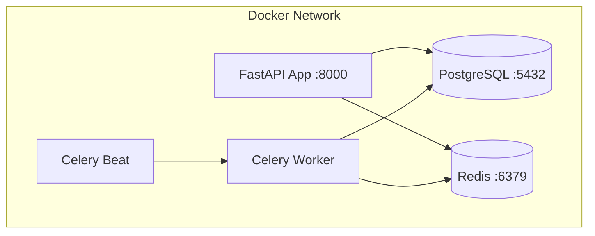

### 10.2 Production Considerations

For production deployment:

1. **Container Orchestration**: Kubernetes or ECS
2. **Database**: Managed PostgreSQL (RDS/Cloud SQL)
3. **Cache**: Managed Redis (ElastiCache/Memorystore)
4. **Load Balancer**: ALB/Cloud Load Balancer
5. **Secrets**: Vault or cloud secrets manager

---

## 11. Technology Choices

### 11.1 Why FastAPI?

| Feature | Benefit |
|---------|---------|
| Async support | High concurrency handling |
| Automatic docs | OpenAPI/Swagger built-in |
| Pydantic | Type safety, validation |
| Performance | One of fastest Python frameworks |

### 11.2 Why PostgreSQL?

| Feature | Benefit |
|---------|---------|
| ACID compliance | Transactional integrity |
| Row-level locking | Concurrent seat access |
| JSON support | Flexible data storage |
| Mature ecosystem | Well-understood |

### 11.3 Why Redis?

| Feature | Benefit |
|---------|---------|
| Sub-millisecond latency | Fast cache reads |
| Data structures | Rate limiting support |
| Pub/Sub | Event notifications |
| Persistence options | Optional durability |

### 11.4 Why Celery?

| Feature | Benefit |
|---------|---------|
| Task scheduling | Delayed seat expiration |
| Periodic tasks | Cleanup jobs |
| Retry support | Reliable execution |
| Monitoring | Flower dashboard |

