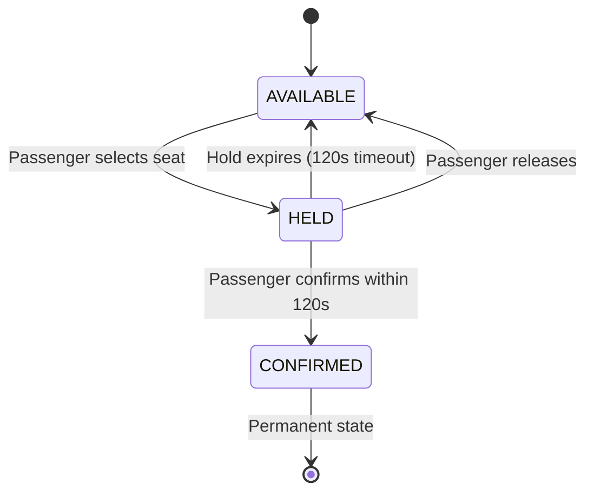
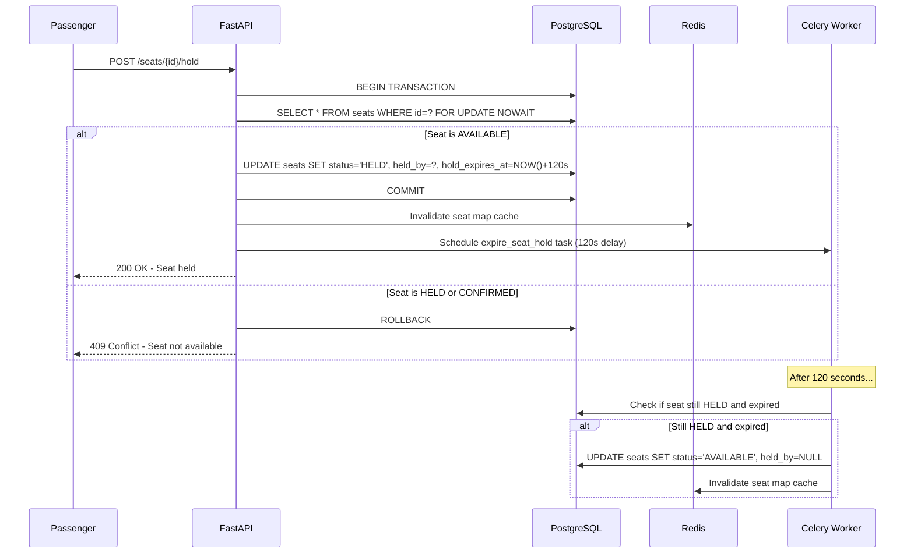
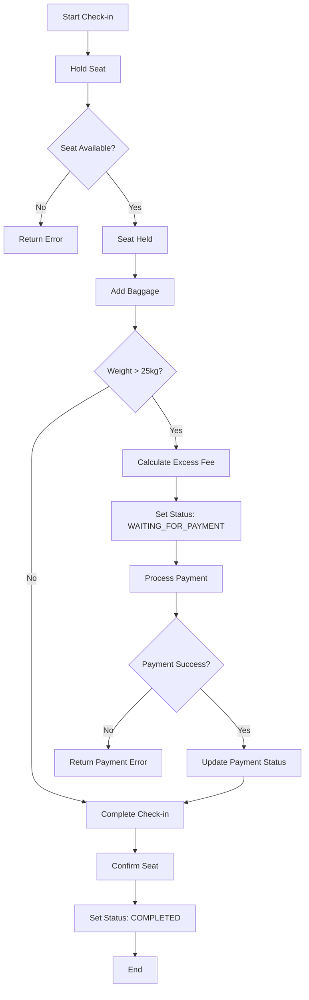
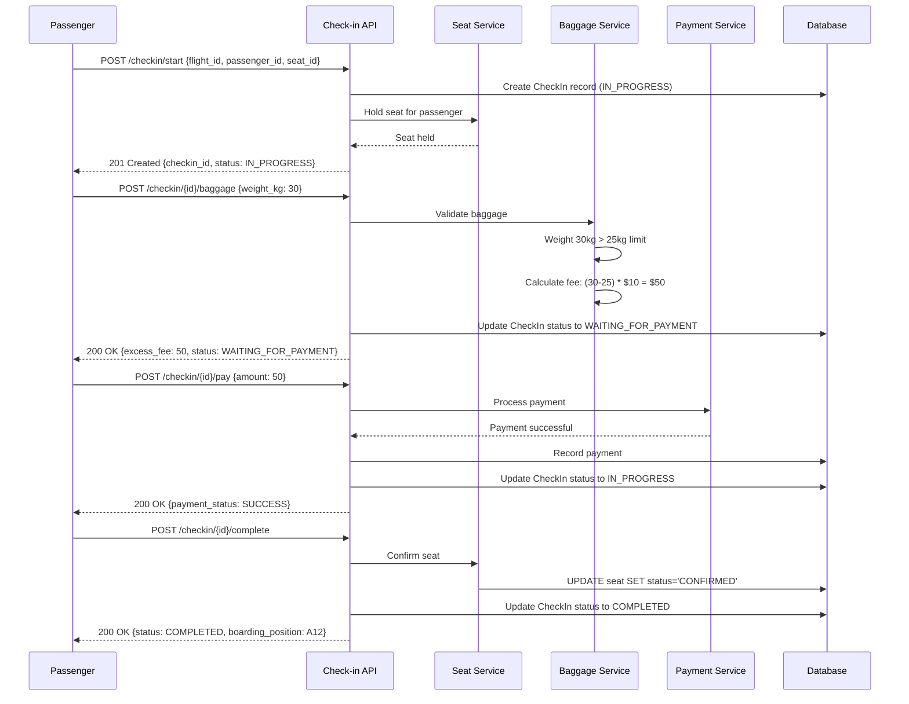
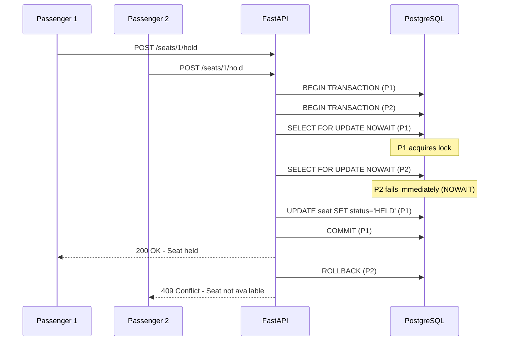
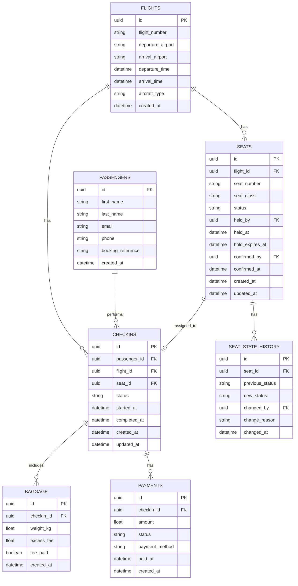
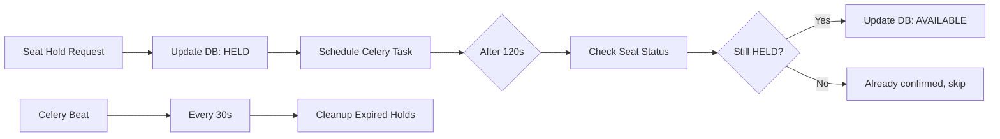
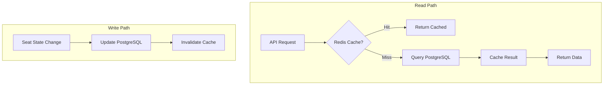

# Workflow Design

This document explains the implementation details, flow diagrams, and database schema for the SkyHigh Core system.

---

## 1. Core Workflows

### 1.1 Seat Hold Lifecycle

The seat hold workflow ensures conflict-free seat selection with automatic expiration.



#### Seat Hold Flow



### 1.2 Check-in Flow

The complete check-in process with baggage validation and payment.



#### Check-in Sequence Diagram



### 1.3 Concurrent Seat Selection

How the system handles multiple passengers trying to select the same seat.



### 1.4 Seat Map Caching

High-performance seat map access with Redis caching.

```mermaid
flowchart TD
    A[GET /flights/{id}/seats] --> B{Check Redis Cache}
    B -->|Cache Hit| C[Return Cached Data]
    B -->|Cache Miss| D[Query PostgreSQL]
    D --> E[Build Seat Map Response]
    E --> F[Store in Redis with TTL]
    F --> G[Return Seat Map]
    
    H[Seat Status Change] --> I[Invalidate Cache]
    I --> J[Next request fetches fresh data]
```

---

## 2. Database Schema

### 2.1 Entity Relationship Diagram



### 2.2 Table Definitions

#### flights

| Column | Type | Constraints | Description |
|--------|------|-------------|-------------|
| id | UUID | PRIMARY KEY | Unique flight identifier |
| flight_number | VARCHAR(10) | NOT NULL | Flight number (e.g., SH101) |
| departure_airport | VARCHAR(3) | NOT NULL | IATA code |
| arrival_airport | VARCHAR(3) | NOT NULL | IATA code |
| departure_time | TIMESTAMP | NOT NULL | Scheduled departure |
| arrival_time | TIMESTAMP | NOT NULL | Scheduled arrival |
| aircraft_type | VARCHAR(20) | | Aircraft model |
| created_at | TIMESTAMP | DEFAULT NOW() | Record creation time |

#### seats

| Column | Type | Constraints | Description |
|--------|------|-------------|-------------|
| id | UUID | PRIMARY KEY | Unique seat identifier |
| flight_id | UUID | FOREIGN KEY, NOT NULL | Reference to flight |
| seat_number | VARCHAR(4) | NOT NULL | Seat designation (e.g., 12A) |
| seat_class | VARCHAR(20) | DEFAULT 'economy' | economy/business/first |
| status | VARCHAR(20) | DEFAULT 'AVAILABLE' | AVAILABLE/HELD/CONFIRMED |
| held_by | UUID | FOREIGN KEY | Passenger holding the seat |
| held_at | TIMESTAMP | | When seat was held |
| hold_expires_at | TIMESTAMP | | When hold expires |
| confirmed_by | UUID | FOREIGN KEY | Passenger who confirmed |
| confirmed_at | TIMESTAMP | | When seat was confirmed |
| created_at | TIMESTAMP | DEFAULT NOW() | Record creation time |
| updated_at | TIMESTAMP | | Last update time |

**Indexes:**
- `idx_seats_flight_id` on `flight_id`
- `idx_seats_status` on `status`
- `idx_seats_flight_status` on `(flight_id, status)`
- `idx_seats_hold_expires` on `hold_expires_at` WHERE `status = 'HELD'`

**Constraints:**
- UNIQUE `(flight_id, seat_number)`
- CHECK `status IN ('AVAILABLE', 'HELD', 'CONFIRMED')`

#### passengers

| Column | Type | Constraints | Description |
|--------|------|-------------|-------------|
| id | UUID | PRIMARY KEY | Unique passenger identifier |
| first_name | VARCHAR(100) | NOT NULL | First name |
| last_name | VARCHAR(100) | NOT NULL | Last name |
| email | VARCHAR(255) | UNIQUE, NOT NULL | Email address |
| phone | VARCHAR(20) | | Phone number |
| booking_reference | VARCHAR(10) | NOT NULL | Booking reference code |
| created_at | TIMESTAMP | DEFAULT NOW() | Record creation time |

#### checkins

| Column | Type | Constraints | Description |
|--------|------|-------------|-------------|
| id | UUID | PRIMARY KEY | Unique check-in identifier |
| passenger_id | UUID | FOREIGN KEY, NOT NULL | Reference to passenger |
| flight_id | UUID | FOREIGN KEY, NOT NULL | Reference to flight |
| seat_id | UUID | FOREIGN KEY | Assigned seat |
| status | VARCHAR(30) | DEFAULT 'IN_PROGRESS' | Check-in status |
| started_at | TIMESTAMP | DEFAULT NOW() | When check-in started |
| completed_at | TIMESTAMP | | When check-in completed |
| created_at | TIMESTAMP | DEFAULT NOW() | Record creation time |
| updated_at | TIMESTAMP | | Last update time |

**Constraints:**
- CHECK `status IN ('IN_PROGRESS', 'WAITING_FOR_PAYMENT', 'COMPLETED')`
- UNIQUE `(passenger_id, flight_id)` (one check-in per passenger per flight)

#### baggage

| Column | Type | Constraints | Description |
|--------|------|-------------|-------------|
| id | UUID | PRIMARY KEY | Unique baggage identifier |
| checkin_id | UUID | FOREIGN KEY, NOT NULL | Reference to check-in |
| weight_kg | DECIMAL(5,2) | NOT NULL | Weight in kilograms |
| excess_fee | DECIMAL(10,2) | DEFAULT 0 | Fee for excess weight |
| fee_paid | BOOLEAN | DEFAULT FALSE | Whether fee is paid |
| created_at | TIMESTAMP | DEFAULT NOW() | Record creation time |

#### payments

| Column | Type | Constraints | Description |
|--------|------|-------------|-------------|
| id | UUID | PRIMARY KEY | Unique payment identifier |
| checkin_id | UUID | FOREIGN KEY, NOT NULL | Reference to check-in |
| amount | DECIMAL(10,2) | NOT NULL | Payment amount |
| status | VARCHAR(20) | DEFAULT 'PENDING' | PENDING/SUCCESS/FAILED |
| payment_method | VARCHAR(50) | | Payment method used |
| paid_at | TIMESTAMP | | When payment was made |
| created_at | TIMESTAMP | DEFAULT NOW() | Record creation time |

#### seat_state_history

| Column | Type | Constraints | Description |
|--------|------|-------------|-------------|
| id | UUID | PRIMARY KEY | Unique history identifier |
| seat_id | UUID | FOREIGN KEY, NOT NULL | Reference to seat |
| previous_status | VARCHAR(20) | | Status before change |
| new_status | VARCHAR(20) | NOT NULL | Status after change |
| changed_by | UUID | FOREIGN KEY | Passenger who caused change |
| change_reason | VARCHAR(100) | | Reason for change |
| changed_at | TIMESTAMP | DEFAULT NOW() | When change occurred |

---

## 3. Concurrency Control Strategy

### 3.1 Database-Level Locking

We use PostgreSQL's `SELECT ... FOR UPDATE NOWAIT` for conflict-free seat assignment:

```sql
-- Attempt to hold a seat
BEGIN;

SELECT * FROM seats 
WHERE id = :seat_id AND status = 'AVAILABLE'
FOR UPDATE NOWAIT;

-- If above succeeds, update the seat
UPDATE seats 
SET status = 'HELD',
    held_by = :passenger_id,
    held_at = NOW(),
    hold_expires_at = NOW() + INTERVAL '120 seconds'
WHERE id = :seat_id;

COMMIT;
```

**Why NOWAIT?**
- Fails immediately if seat is locked by another transaction
- Provides instant feedback to user
- Prevents request pile-up during high concurrency

### 3.2 Optimistic vs Pessimistic Locking

| Approach | Pros | Cons | Our Choice |
|----------|------|------|------------|
| Optimistic | No locks, good for low contention | Requires retry logic, version conflicts | ❌ |
| Pessimistic (FOR UPDATE) | Guaranteed consistency, simple logic | Potential for lock contention | ✅ |
| Pessimistic (FOR UPDATE NOWAIT) | Fast failure, no waiting | Must handle lock failure | ✅ Selected |

### 3.3 State History Tracking

Every seat state change is recorded in `seat_state_history`:

```python
# On seat hold
await record_state_change(
    seat_id=seat.id,
    previous_status='AVAILABLE',
    new_status='HELD',
    changed_by=passenger_id,
    change_reason='passenger_selected_seat'
)

# On hold expiration
await record_state_change(
    seat_id=seat.id,
    previous_status='HELD',
    new_status='AVAILABLE',
    changed_by=None,
    change_reason='hold_expired_automatically'
)
```

---

## 4. Background Task Processing

### 4.1 Seat Hold Expiration

Two mechanisms ensure seats are released:

#### 1. Delayed Task (Primary)
When a seat is held, schedule a Celery task:

```python
# Schedule task to run after 120 seconds
expire_seat_hold.apply_async(
    args=[seat_id],
    countdown=120
)
```

#### 2. Periodic Cleanup (Fallback)
Every 30 seconds, clean up any missed expirations:

```python
@celery_app.task
def cleanup_expired_holds():
    """Periodic task to catch any missed expirations"""
    db.execute("""
        UPDATE seats 
        SET status = 'AVAILABLE',
            held_by = NULL,
            held_at = NULL,
            hold_expires_at = NULL
        WHERE status = 'HELD' 
        AND hold_expires_at < NOW()
    """)
```

### 4.2 Task Flow



---

## 5. Caching Strategy

### 5.1 Cache Architecture



### 5.2 Cache Keys

| Key Pattern | TTL | Description |
|-------------|-----|-------------|
| `seat_map:{flight_id}` | 30s | Full seat map for a flight |
| `seat:{seat_id}` | 30s | Individual seat status |
| `rate_limit:{ip}:{endpoint}` | 60s | Rate limiting counter |

### 5.3 Cache Invalidation

```python
# On any seat status change
async def invalidate_seat_cache(flight_id: str, seat_id: str):
    await redis.delete(f"seat_map:{flight_id}")
    await redis.delete(f"seat:{seat_id}")
```

---

## 6. Rate Limiting

### 6.1 Implementation

Sliding window rate limiting using Redis:

```python
async def check_rate_limit(key: str, limit: int, window: int) -> bool:
    """
    Returns True if request is allowed, False if rate limited
    """
    current = int(time.time())
    window_start = current - window
    
    pipe = redis.pipeline()
    pipe.zremrangebyscore(key, 0, window_start)  # Remove old entries
    pipe.zadd(key, {str(current): current})       # Add current request
    pipe.zcard(key)                               # Count requests
    pipe.expire(key, window)                      # Set TTL
    
    results = await pipe.execute()
    request_count = results[2]
    
    return request_count <= limit
```

### 6.2 Rate Limits

| Endpoint | Limit | Window |
|----------|-------|--------|
| GET /flights/{id}/seats | 100 | 60s |
| POST /seats/{id}/hold | 10 | 60s |
| POST /seats/{id}/confirm | 10 | 60s |
| POST /checkin/* | 20 | 60s |

---

## 7. Error Handling

### 7.1 Error Codes

| Error | HTTP Status | Description |
|-------|-------------|-------------|
| SEAT_NOT_AVAILABLE | 409 | Seat is held or confirmed |
| SEAT_NOT_FOUND | 404 | Seat doesn't exist |
| HOLD_EXPIRED | 410 | Hold timeout exceeded |
| PAYMENT_REQUIRED | 402 | Excess baggage fee unpaid |
| RATE_LIMITED | 429 | Too many requests |
| INVALID_STATE | 400 | Invalid state transition |

### 7.2 Error Response Format

```json
{
    "error": {
        "code": "SEAT_NOT_AVAILABLE",
        "message": "Seat 12A is currently held by another passenger",
        "details": {
            "seat_id": "uuid",
            "current_status": "HELD",
            "hold_expires_at": "2026-03-09T10:32:00Z"
        }
    }
}
```

